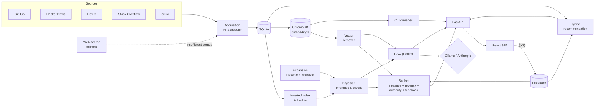

# Tech RAG Information Retrieval System

🇬🇧 English (you are here) · 🇪🇸 [Leer en español](README.es.md)

**Information Retrieval (IR) system with RAG for the technology/software domain.**
Searches and synthesizes current technical information — GitHub repos, Hacker News
threads, Stack Overflow, Dev.to articles, arXiv papers — and answers user questions
with RAG, always citing the retrieved sources.

Personal project built from scratch as a portfolio piece: every module of the
architecture (acquisition, indexing, retrieval, RAG, ranking, UI, web search,
expansion/feedback, multimodal, recommendation, evaluation) is a from-scratch
implementation, with no orchestration framework in between.

## Architecture



### Modules

| # | Module | Implementation |
|---|---|---|
| 1 | Data acquisition | Connectors to 5 APIs (GitHub, HN, Dev.to, StackExchange, arXiv) + periodic refresh with APScheduler — [`backend/app/acquisition/`](backend/app/acquisition/) |
| 2 | Indexing | Custom inverted index + TF-IDF — [`backend/app/indexing/`](backend/app/indexing/) |
| 3 | Retriever (non-basic) | **Bayesian Inference Network** (Turtle & Croft, 1991), noisy-OR over document→term→query nodes — [`inference_network.py`](backend/app/retrieval/inference_network.py) |
| 4 | Vector database | Persistent ChromaDB, `sentence-transformers` embeddings, chunking so long documents aren't truncated — [`backend/app/vectorstore/`](backend/app/vectorstore/) |
| 5 | RAG | Custom pipeline: fuses both retrievers, generates a cited answer, swappable LLM provider (Ollama / Anthropic) — [`backend/app/rag/`](backend/app/rag/) |
| 6 | Ranking | `Ranker` fuses relevance + recency + source authority + aggregated feedback — [`backend/app/ranking/`](backend/app/ranking/) |
| 7 | UI | React + TypeScript SPA: rank badges, cited-answer panel, filters — [`frontend/`](frontend/) |
| 8 | Web search | Insufficiency detection (volume/quality/coverage) → DuckDuckGo fallback, results indexed for future queries — [`backend/app/web_search/`](backend/app/web_search/) |
| 9 | Expansion and feedback | Rocchio (pseudo-relevance) + WordNet synonyms; 👍/👎 feedback that feeds back into ranking — [`backend/app/expansion/`](backend/app/expansion/) |
| 10 | Multimodal | Images embedded with CLIP in a separate Chroma collection, text→image search — [`backend/app/multimodal/`](backend/app/multimodal/) |
| 11 | Recommendation | Hybrid content-based (embedding profile) + collaborative (co-visitation) — [`backend/app/recommendation/`](backend/app/recommendation/) |
| 12 | Evaluation | Precision@k, Recall@k, MAP, MRR, nDCG against frozen custom qrels + RAG faithfulness (LLM-as-judge) — [`backend/app/evaluation/`](backend/app/evaluation/) |

## Tech stack

- **Backend**: Python 3.11+, FastAPI, SQLAlchemy + SQLite, ChromaDB, sentence-transformers, APScheduler
- **Frontend**: React 19, TypeScript, Vite
- **LLM**: Ollama (local, default) or Anthropic Claude (with `ANTHROPIC_API_KEY`) — swappable without touching code
- **Tests**: pytest (backend, 120+ tests) and Vitest + React Testing Library (frontend)
- **CI**: GitHub Actions (lint + tests on every push, backend and frontend separately)

## Getting started

### Option A — Docker Compose (all-in-one)

```bash
docker compose up --build
```

This starts the backend (`:8000`), frontend (`:8080`), and an Ollama container (`:11434`).
The first time, pull a model into the Ollama container:

```bash
docker compose exec ollama ollama pull llama3.1
```

To use Anthropic instead of Ollama, set `ANTHROPIC_API_KEY` in the environment before
starting the containers (or in a root `.env`) — the backend detects the key
automatically.

### Option B — Manual (development)

**Backend**

```bash
cd backend
python -m venv .venv && .venv/Scripts/activate  # or source .venv/bin/activate on Unix
pip install -e ".[dev]"
cp .env.example .env
uvicorn app.main:app --reload
```

**Frontend**

```bash
cd frontend
npm install
npm run dev
```

The Vite proxy forwards `/api/*` to `http://localhost:8000`, so just open
`http://localhost:5173`.

### Local Ollama (optional, for cost-free RAG)

```bash
ollama serve
ollama pull llama3.1
```

Without an `ANTHROPIC_API_KEY` configured, the backend uses Ollama automatically
(`LLM_PROVIDER=auto`, the default).

## Evaluation

```bash
python scripts/evaluate.py
```

Runs classic IR metrics against a frozen, custom corpus and qrels
(`backend/data/evaluation/`), so the numbers are reproducible independently of
the state of the live-acquired corpus. Also available as `POST
/api/evaluation/run`.

## Tests

```bash
# backend
cd backend && pytest

# frontend
cd frontend && npm test
```

## API quick reference

| Endpoint | Description |
|---|---|
| `GET /api/search` | Search with `mode` (`inference_network`/`vector`), `expand`, ranking applied |
| `GET /api/rag/answer` | RAG-generated answer with citations |
| `GET /api/multimodal/search` | Image search by text (CLIP) |
| `GET /api/recommendations` | Recommendations for a `user_id` |
| `POST /api/feedback` | Records a 👍/👎 vote |
| `POST /api/acquisition/refresh` | Manually triggers acquisition + reindexing |
| `POST /api/evaluation/run` | Runs the IR evaluation |

## Project structure

```
tech-rag-information-retrieval-system/
├── backend/
│   └── app/
│       ├── acquisition/     # connectors + scheduler
│       ├── indexing/        # inverted index + TF-IDF
│       ├── retrieval/       # inference network + vector retriever
│       ├── vectorstore/     # ChromaDB + embeddings + chunking
│       ├── rag/             # RAG pipeline + LLM providers
│       ├── ranking/         # signal fusion
│       ├── web_search/      # fallback + insufficiency detection
│       ├── expansion/       # Rocchio + WordNet + feedback
│       ├── multimodal/      # CLIP + images
│       ├── recommendation/  # content-based + collaborative
│       ├── evaluation/      # IR metrics + RAG faithfulness
│       ├── api/routes/      # FastAPI endpoints
│       └── db/              # SQLAlchemy models
├── frontend/src/
│   ├── api/                 # typed client
│   └── components/          # SearchBar, ResultCard, RagAnswerPanel...
├── scripts/                 # build_index.py, evaluate.py
└── docker-compose.yml
```

## License

MIT — see [LICENSE](LICENSE).
