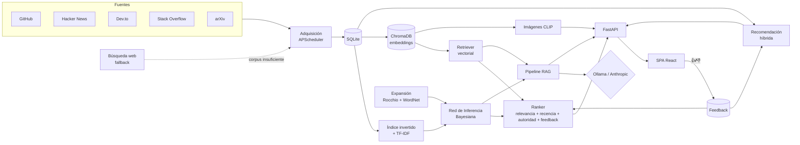

# Tech RAG Information Retrieval System

**Sistema de Recuperación de Información (SRI) con RAG para el dominio de tecnología y
software.** Busca y sintetiza información técnica actual —repos de GitHub, hilos de Hacker
News y Stack Overflow, artículos de Dev.to, papers de arXiv— y responde preguntas del
usuario con RAG, citando siempre las fuentes recuperadas.

Proyecto personal construido desde cero como pieza de portfolio: cada módulo de la
arquitectura (adquisición, indexación, recuperación, RAG, posicionamiento, interfaz,
búsqueda web, expansión/retroalimentación, multimodal, recomendación, evaluación) es una
implementación propia, sin frameworks de orquestación de por medio.

## Arquitectura



### Módulos

| # | Módulo | Implementación |
|---|---|---|
| 1 | Adquisición de datos | Conectores a 5 APIs (GitHub, HN, Dev.to, StackExchange, arXiv) + refresco periódico con APScheduler — [`backend/app/acquisition/`](backend/app/acquisition/) |
| 2 | Indexación | Índice invertido + TF-IDF propio — [`backend/app/indexing/`](backend/app/indexing/) |
| 3 | Recuperador (no básico) | **Red de Inferencia Bayesiana** (Turtle & Croft, 1991), noisy-OR sobre nodos documento→término→consulta — [`inference_network.py`](backend/app/retrieval/inference_network.py) |
| 4 | Base de datos vectorial | ChromaDB persistente, embeddings `sentence-transformers`, chunking para no truncar documentos largos — [`backend/app/vectorstore/`](backend/app/vectorstore/) |
| 5 | RAG | Pipeline propio: fusiona ambos retrievers, genera respuesta citada, proveedor de LLM intercambiable (Ollama / Anthropic) — [`backend/app/rag/`](backend/app/rag/) |
| 6 | Posicionamiento | `Ranker` fusiona relevancia + recencia + autoridad de fuente + feedback agregado — [`backend/app/ranking/`](backend/app/ranking/) |
| 7 | Interfaz visual | SPA en React + TypeScript: badges de posición, panel de respuesta con citas, filtros — [`frontend/`](frontend/) |
| 8 | Búsqueda web | Detección de insuficiencia (cantidad/calidad/cobertura) → fallback DuckDuckGo, resultados indexados para consultas futuras — [`backend/app/web_search/`](backend/app/web_search/) |
| 9 | Expansión y retroalimentación | Rocchio (pseudo-relevancia) + sinónimos WordNet; feedback 👍/👎 que alimenta el ranking — [`backend/app/expansion/`](backend/app/expansion/) |
| 10 | Multimodal | Imágenes embebidas con CLIP en una colección Chroma independiente, búsqueda texto→imagen — [`backend/app/multimodal/`](backend/app/multimodal/) |
| 11 | Recomendación | Híbrido content-based (perfil de embeddings) + colaborativo (co-visitación) — [`backend/app/recommendation/`](backend/app/recommendation/) |
| 12 | Evaluación | Precision@k, Recall@k, MAP, MRR, nDCG contra qrels propios y congelados + fidelidad del RAG (LLM-as-judge) — [`backend/app/evaluation/`](backend/app/evaluation/) |

## Stack técnico

- **Backend**: Python 3.11+, FastAPI, SQLAlchemy + SQLite, ChromaDB, sentence-transformers, APScheduler
- **Frontend**: React 19, TypeScript, Vite
- **LLM**: Ollama (local, por defecto) o Anthropic Claude (con `ANTHROPIC_API_KEY`) — intercambiables sin tocar código
- **Tests**: pytest (backend, 120+ tests) y Vitest + React Testing Library (frontend)
- **CI**: GitHub Actions (lint + tests en cada push, backend y frontend por separado)

## Puesta en marcha

### Opción A — Docker Compose (todo junto)

```bash
docker compose up --build
```

Esto levanta backend (`:8000`), frontend (`:8080`) y un contenedor de Ollama (`:11434`).
La primera vez, descarga un modelo en el contenedor de Ollama:

```bash
docker compose exec ollama ollama pull llama3.1
```

Para usar Anthropic en vez de Ollama, define `ANTHROPIC_API_KEY` en el entorno antes de
levantar los contenedores (o en un `.env` en la raíz) — el backend detecta la key
automáticamente.

### Opción B — Manual (desarrollo)

**Backend**

```bash
cd backend
python -m venv .venv && .venv/Scripts/activate  # o source .venv/bin/activate en Unix
pip install -e ".[dev]"
cp .env.example .env
uvicorn app.main:app --reload
```

**Frontend**

```bash
cd frontend
npm install
npm run dev
```

El proxy de Vite reenvía `/api/*` a `http://localhost:8000`, así que basta con abrir
`http://localhost:5173`.

### Ollama local (opcional, para RAG sin costo)

```bash
ollama serve
ollama pull llama3.1
```

Sin `ANTHROPIC_API_KEY` configurada, el backend usa Ollama automáticamente
(`LLM_PROVIDER=auto`, el valor por defecto).

## Evaluación

```bash
python scripts/evaluate.py
```

Corre las métricas clásicas de RI contra un corpus y qrels propios y congelados
(`backend/data/evaluation/`), para que los números sean reproducibles independientemente
del estado del corpus adquirido en vivo. También disponible como `POST
/api/evaluation/run`.

## Tests

```bash
# backend
cd backend && pytest

# frontend
cd frontend && npm test
```

## Referencia rápida de la API

| Endpoint | Descripción |
|---|---|
| `GET /api/search` | Búsqueda con `mode` (`inference_network`/`vector`), `expand`, ranking aplicado |
| `GET /api/rag/answer` | Respuesta generada por RAG con citas |
| `GET /api/multimodal/search` | Búsqueda de imágenes por texto (CLIP) |
| `GET /api/recommendations` | Recomendaciones para un `user_id` |
| `POST /api/feedback` | Registra un voto 👍/👎 |
| `POST /api/acquisition/refresh` | Dispara adquisición + reindexado manualmente |
| `POST /api/evaluation/run` | Corre la evaluación de RI |

## Estructura del proyecto

```
tech-rag-information-retrieval-system/
├── backend/
│   └── app/
│       ├── acquisition/     # conectores + scheduler
│       ├── indexing/        # índice invertido + TF-IDF
│       ├── retrieval/       # Red de Inferencia + retriever vectorial
│       ├── vectorstore/     # ChromaDB + embeddings + chunking
│       ├── rag/             # pipeline RAG + proveedores LLM
│       ├── ranking/         # fusión de señales
│       ├── web_search/      # fallback + insuficiencia
│       ├── expansion/       # Rocchio + WordNet + feedback
│       ├── multimodal/      # CLIP + imágenes
│       ├── recommendation/  # content-based + colaborativo
│       ├── evaluation/      # métricas RI + fidelidad RAG
│       ├── api/routes/      # endpoints FastAPI
│       └── db/              # modelos SQLAlchemy
├── frontend/src/
│   ├── api/                 # cliente tipado
│   └── components/          # SearchBar, ResultCard, RagAnswerPanel...
├── scripts/                 # build_index.py, evaluate.py
└── docker-compose.yml
```

## Licencia

MIT — ver [LICENSE](LICENSE).
